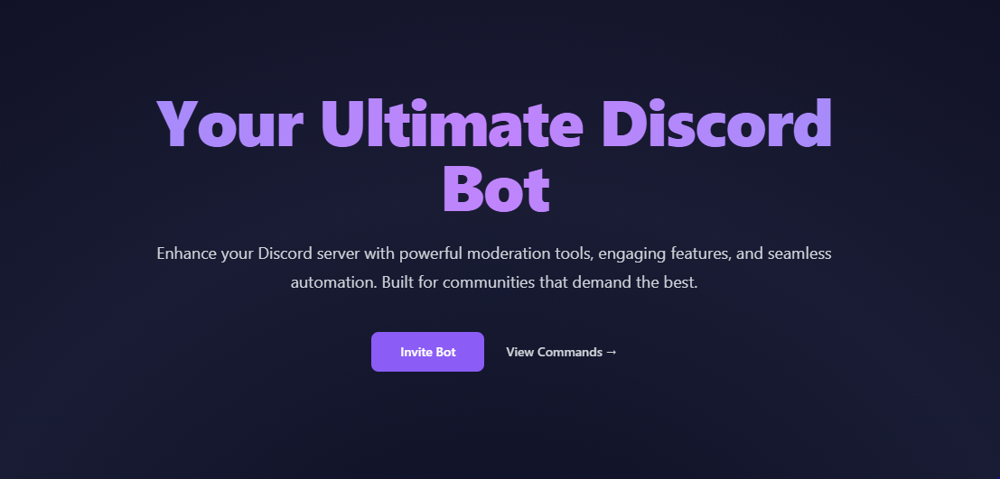

# Heecshi Discord Bot Website

<div align="center">



[](https://nextjs.org/)
[](https://tailwindcss.com/)
[](https://www.docker.com/)
[](https://opensource.org/licenses/MIT)
[](https://heecshi-website.vercel.app/)
[](https://github.com/Hoocs151/heecshi-website/commits/main)

A modern, responsive website for the Heecshi Discord bot built with Next.js and Tailwind CSS. Experience seamless navigation, beautiful animations, and a user-friendly interface designed to showcase and manage your Discord bot experience.

[Live Demo](https://heecshi-website.vercel.app/) · [Report Bug](https://github.com/Hoocs151/heecshi-website/issues) · [Request Feature](https://github.com/Hoocs151/heecshi-website/issues)

</div>

## 📌 Table of Contents
- [✨ Features](#-features)
- [🛠️ Tech Stack](#️-tech-stack)
- [🚀 Getting Started](#-getting-started)
- [🎨 Customization](#-customization)
- [📱 Responsive Design](#-responsive-design)
- [🔧 Development](#-development)
- [📊 Performance](#-performance)
- [🔒 Security](#-security)
- [🌐 Deployment](#-deployment)
- [🤝 Contributing](#-contributing)
- [📄 License](#-license)
- [👥 Authors](#-authors)
- [🙏 Acknowledgments](#-acknowledgments)

## ✨ Features

### Core Features
- 🎨 Modern UI with glassmorphism effects
- 🌟 Smooth page transitions and animations
- 🖱️ Custom interactive cursor
- 🎭 Dynamic particle background
- 📱 Fully responsive design
- 🚀 Optimized performance
- 🌐 SEO friendly
- 🎯 Easy navigation

### Additional Features
- 📜 Terms of Service and Privacy Policy pages
- 🌙 Dark mode support with system preference detection
- 🔒 Security best practices implementation
- 🌍 Internationalization ready (i18n)
- 📊 Analytics integration ready
- 🔄 CI/CD pipeline setup
- 📱 PWA support
- 🎨 Customizable theme system

## 🛠️ Tech Stack

### Core Technologies
- **Framework**: [Next.js](https://nextjs.org/) - React framework for production
- **Styling**: [Tailwind CSS](https://tailwindcss.com/) - Utility-first CSS framework
- **Animations**: [Framer Motion](https://www.framer.com/motion/) - Production-ready motion library
- **State Management**: [React Context](https://reactjs.org/docs/context.html) - For global state management

### Development Tools
- **Package Manager**: [npm](https://www.npmjs.com/) - Dependency management
- **Linting**: [ESLint](https://eslint.org/) - Code quality tool
- **Formatting**: [Prettier](https://prettier.io/) - Code formatter
- **Testing**: [Jest](https://jestjs.io/) & [React Testing Library](https://testing-library.com/react)

### DevOps & Deployment
- **Containerization**: [Docker](https://www.docker.com/) - Application containerization
- **CI/CD**: GitHub Actions - Automated workflows
- **Hosting**: [Vercel](https://vercel.com/) - Edge-optimized hosting
- **Monitoring**: [Sentry](https://sentry.io/) - Error tracking

## 🚀 Getting Started

### Prerequisites

Ensure you have installed:
- [Node.js](https://nodejs.org/) (v14 or higher)
- [npm](https://www.npmjs.com/) (v7 or higher) or [yarn](https://yarnpkg.com/)
- [Git](https://git-scm.com/)
- [Docker](https://www.docker.com/) (optional)

### Quick Start

1. **Clone the repository**
   ```bash
   git clone https://github.com/yourusername/heecshi-website.git
   cd heecshi-website
   ```

2. **Install dependencies**
   ```bash
   npm install
   # or
   yarn install
   ```

3. **Set up environment variables**
   ```bash
   cp .env.example .env.local
   # Edit .env.local with your values
   ```

4. **Start development server**
   ```bash
   npm run dev
   # or
   yarn dev
   ```

Visit `http://localhost:3000` to see your app.

### Docker Setup

1. **Build the image**
   ```bash
   docker build -t heecshi-website .
   ```

2. **Run the container**
   ```bash
   docker run -p 80:80 heecshi-website
   ```

3. **Using Docker Compose**
   ```bash
   docker-compose up -d
   ```

## 🎨 Customization

### Theme Configuration
Customize the website's appearance through:
- `tailwind.config.js` - Design tokens and theme variants
- `src/styles/globals.css` - Global styles
- `src/theme/index.js` - Theme context

### Component Customization
Modify core components:
```jsx
src/components/
├── common/
│   ├── CustomCursor/
│   ├── AnimatedBackground/
│   └── ThemeToggle/
└── layout/
    ├── Header/
    ├── Footer/
    └── Navigation/
```

## 🔒 Security

- ✅ HTTPS enforced
- ✅ Content Security Policy
- ✅ XSS Protection
- ✅ CSRF Protection
- ✅ Rate Limiting
- ✅ Security Headers
- ✅ Input Validation
- ✅ Dependency Scanning

## 🌐 Deployment

### Vercel (Recommended)
```bash
npm run deploy
# or
vercel --prod
```

### Manual Deployment
1. Build the application
   ```bash
   npm run build
   ```
2. Start the production server
   ```bash
   npm start
   ```

## 🤝 Contributing

We welcome contributions! Please see our [Contributing Guidelines](CONTRIBUTING.md) for details on:
- Code of Conduct
- Development Process
- Pull Request Process
- Coding Standards

## 📄 License

This project is licensed under the MIT License - see the [LICENSE](LICENSE) file for details.

## 👥 Authors

- **Hoocshi** - *Project Owner* - [GitHub Profile](https://github.com/Hoocs151)
- **AI** - *Boss*

## 🙏 Acknowledgments

- Special thanks to all contributors
- Amazing open-source community
- [Shields.io](https://shields.io/) for badges
- [Heroicons](https://heroicons.com/) for icons
- [unDraw](https://undraw.co/) for illustrations

---

<div align="center">

[⬆ Back to top](#heecshi-discord-bot-website)

</div>
